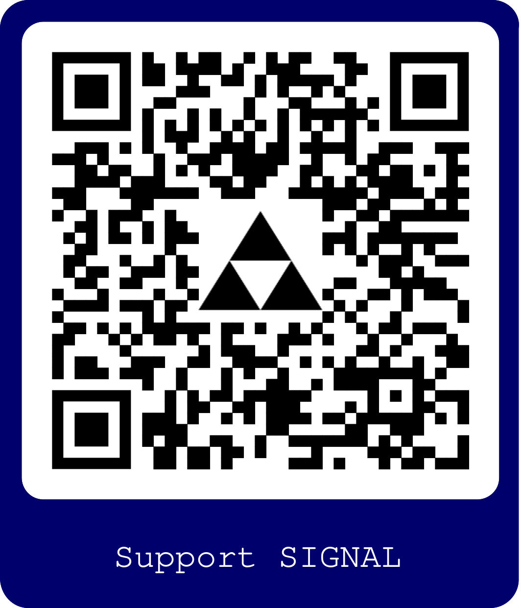

## Author

Designed and developed by [Fedor Ivanov](https://www.linkedin.com/in/fedor-ivanov-4529b738b/)   

In case of any question feel free to [contract author](mailto:fedornivanov@gmail.com?subject=SIGNAL%27s%20user%20request&body=Dear%20Fedor%2C%0A%0A%0A%3E%20Put%20your%20request%20here%20%3C%20%0A%0A%0A%0AMy%20SIGNAL%20version%20is%20v0.20%20%7C%20Released%20in%20October%202025%0A) directly

## Support

The project was designed and developed concerning the everyday needs of banking systems support engineers. 
It helped to save thousands of working hours and meet hundreds of deadlines. The basic monetization concept is that 
Signal is free, always, and for everyone, not depending on usage. All the licensing and copyright targeting firstly 
to protect usage for free 

However, the project needs your support. If you want to support the project you can spend your time, working on it or 
make a voluntary donation directly to the author. 

⚠️ Any donation can be voluntary only

The project needs help

* Code review, architecture development, advice
* Documentation development and translate
* Feedback, ideas
* Testing, especially auto-tests, unit-tests
* Financial support to BTC wallet

<details>
 <summary>️❤️Support the project</summary>
 <p align="left">
  

```
bc1qs2jaqpnse9qgzz9y9wyns50km0f5x4wxe8cggs
```
</p>
</details>